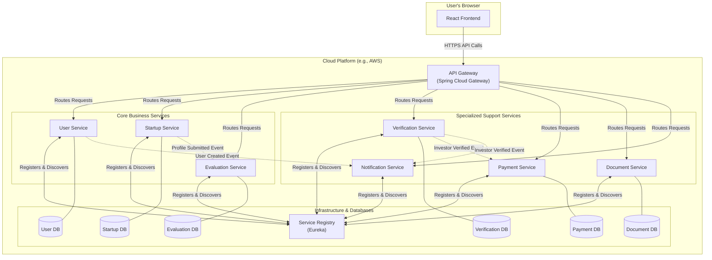

# YouthConnect

**YouthConnect** is a comprehensive platform designed to bridge the gap between emerging startups and potential investors or evaluators. Built on a robust and scalable **microservices architecture**, the system provides a seamless experience for all users.

## Key Features

- Connects startups with evaluators and investors  
- Modular microservices architecture  
- Cloud-native and highly scalable  
- Secure and reliable communication between services  

## Architecture Overview

The platform's architecture leverages **modern cloud-native technologies** to ensure resilience and maintainability.

### Frontend

- **React.js**: A dynamic and responsive user interface.
- Communicates with backend services via **Spring Cloud Gateway**.

### Backend

- **Spring Boot Microservices**: Each service is responsible for a specific business domain:
  - **User Management**
  - **Startup Profile Management**
  - **Evaluation Workflows**
  - **Payment Processing**
  - **Document Management**
  - **User Verification**

- **Spring Cloud Gateway**: Acts as a secure entry point to route API requests.
- **Eureka**: Handles **service discovery**, allowing microservices to register and communicate dynamically.
- **Event-Driven Communication**: For example, a startup submission triggers an automatic evaluation process.

## Benefits

- **Loose Coupling**: Ensures that services remain independent, enabling easier updates and scalability.  
- **High Performance**: Event-driven architecture enhances responsiveness and resource utilization.  
- **Reliability**: Designed for robustness and fault tolerance to support critical operations.  

---

YouthConnect offers a sophisticated, **feature-rich ecosystem** aimed at fostering innovation. It empowers the **next generation of entrepreneurs** by connecting them with the resources they need to **succeed**.

---

## System Architecture Diagram

